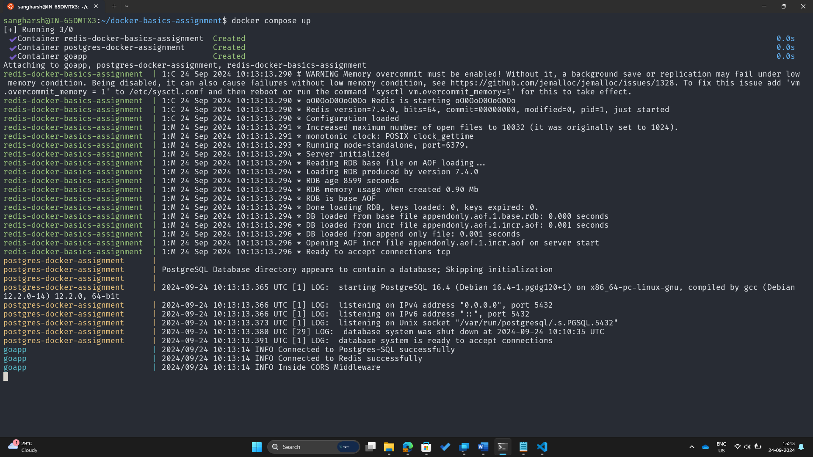
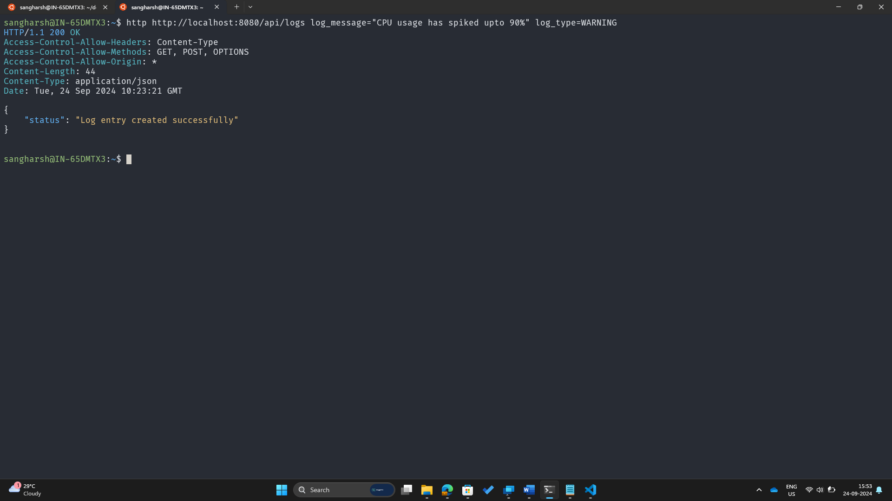
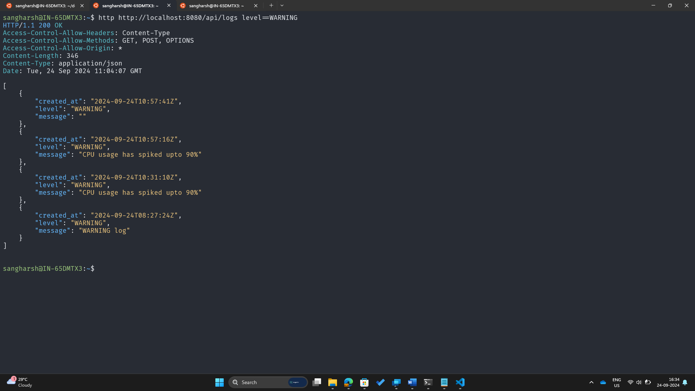
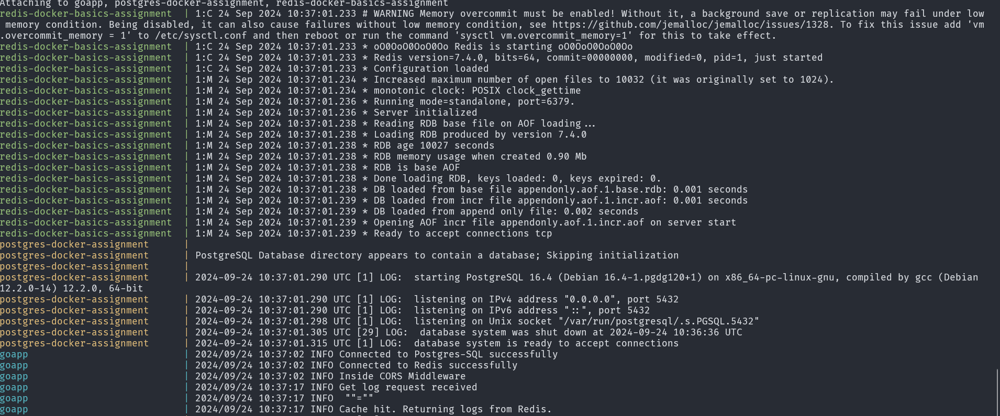

# Log Management System

This project implements a simple log management system using Go, PostgreSQL, and Redis. It provides an API for inserting and retrieving log entries, with caching capabilities for improved performance.

## Features

- Insert log entries via POST request
- Retrieve logs based on time range and log level
- Redis caching for faster log retrieval
- Dockerized setup for easy deployment

## Tech Stack

- Go (Golang) for the main application
- PostgreSQL for persistent storage
- Redis for caching
- Docker and Docker Compose for containerization

## Setup

### Prerequisites

- Docker
- Docker Compose

### Running the Application

1. Clone the repository:
   ```bash
   git clone https://github.com/sangharsh-nagarro/docker-basics-assignment
   cd docker-basics-assignment
   ```
## Environment Variables

The application uses the following environment variables:

- `DATABASE_URL`: PostgreSQL connection string
- `REDIS_URL`: Redis connection string

These are set in the `docker-compose.yml` file.
2. Create a .env file and populate the required env parameters mentioned in the .env.example

3. Build and start the containers:
   ```
   docker compose up -d
   ```

4. The application should now be running and accessible at `http://localhost:8080`.

## API Endpoints

### POST /api/logs

Insert a new log entry.

**Request Body:**
```json
{
  "log_message": "Your log message",
  "log_level": "info"
}
```

### GET /api/logs

Retrieve logs based on the specified parameters.

**Query Parameters:**
- `since`: Time range (e.g., "1h", "24h")
- `level`: (Optional) Log level filter
- `limit`: (Optional) Maximum number of logs to return

**Example:**
```
GET /api/logs?since=1h&level=info&limit=100
```

## Development

To make changes to the project:

1. Modify the Go code as needed.
2. Rebuild the Docker image:
   ```bash
   docker compose build goapp
   ```
3. Restart the containers:
   ```bash
   docker compose up -d
   ```
## Demo Screenshot
The current docker setup has a go application, a redis service as cache and a postgres database.


Post-Query 


Get-Query


Caching-Service


## Troubleshooting

If you encounter any issues:

1. Check the logs of the containers:
   ```bash
   docker compose logs
   ```
2. Ensure all containers are running:
   ```bash
   docker compose ps
   ```
3. Verify the environment variables in the `docker-compose.yml` file.

